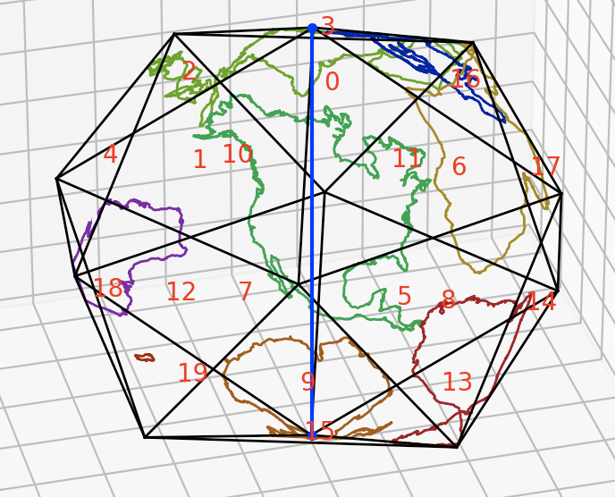
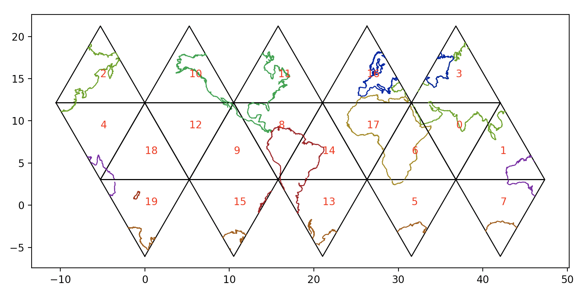
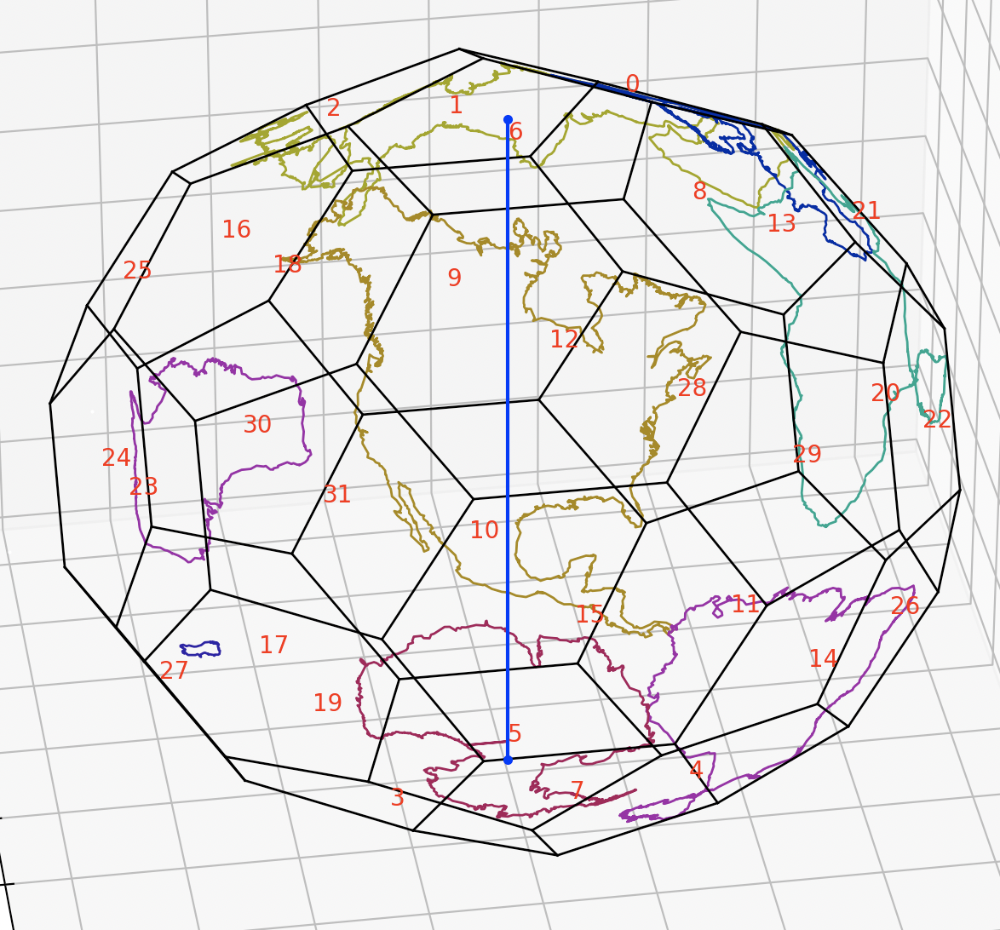
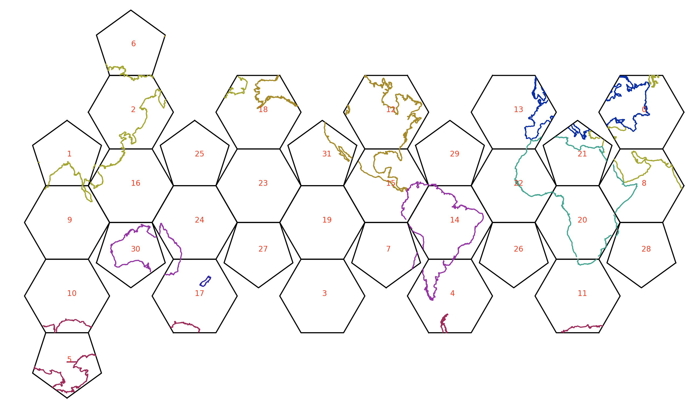

Although the dymaxion projection is quite simple conceptually, generating usable output files is a deceptively hard problem:
- Geodata is messy.
- Core geometry code for dymaxion sphere->polyhedron projection is basically trivial (built on my existing tools for working with regular polyhedra). However...
- CNC layout requires the polyhedron->plane step, which is the majority of the effort:
  - Conceptually, this step is entirely handled by an "unfolder", which is nontrivial.
  - The resulting shapes on each face need to be *closed*, which doesn't happen automatically. This requires computing polygon intersections, preferably spherical polygons, but that turns out to be a pain. My silly workaround is in Dymaxion.project_simple_closed().
  - For the finite-thickness-polhedron -> smoothed sphere case, the obvious dymaxion projection won't look quite right. A "predistorted" version is in the works to account for this.

Additionally, I found some of these aspects worthy of encapsulating in standalone modules:
- dymaxion.py handles different polyhedra and different projection variations.
- vectorized.py provides a unified interface for both matplotlib and svg, and it's actually a second iteration of an existing tool that I use often for laser cutter design work.

Icosahedron [Dymaxion](https://en.wikipedia.org/wiki/Dymaxion_map) projection in 3d:

Unfolded into 2d for printing or CNC:

Truncated icosahedron projection:

Unfolded into 2d for printing or CNC:

# code
- main.py: entry point, and all plot functions, including generate_cnc_layout, which is slightly nontrivial.
- dymaxion.py: implementation of the dymaxion projection.
- vectorized.py: tools for abstracting plotting+svg output into a single interface
- polyhedra.py: definitions of several polyhedra: vertices (generated from symmetry when possible), edges (automatic), faces (automatic), unfolding (ad hoc).
- geometry.py: minor general-purpose 3d geometry functions.
- geography.py: functions for dealing with geojson data.
- configs/*.json: config files to record combinations of settings. pass name as only argument to main.py.

# world map

## data
https://geojson-maps.ash.ms/

- shapefiles - clunky, old fashioned way of storing geo data
- geojson - human readable (so larger), easier to deal with

continents data: https://gist.github.com/hrbrmstr/91ea5cc9474286c72838?short_path=f3fde31
