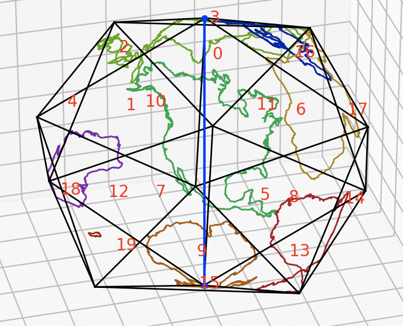
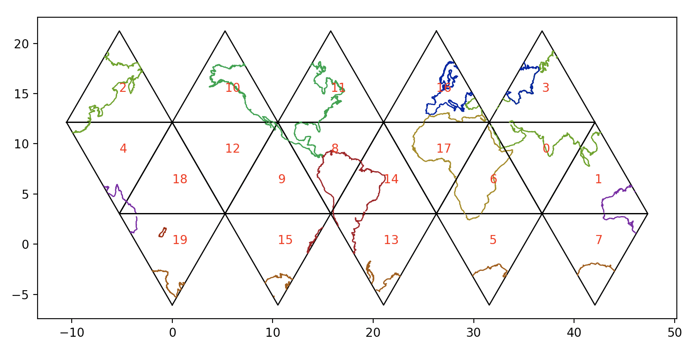

[Dymaxion](https://en.wikipedia.org/wiki/Dymaxion_map) projection in 3d:

Unrolled into 2d for printing or CNC:

# world map

## data
https://geojson-maps.ash.ms/

- shapefiles - clunky, old fashioned way of storing geo data
- geojson - human readable (so larger), easier to deal with

continents data: https://gist.github.com/hrbrmstr/91ea5cc9474286c72838?short_path=f3fde31
