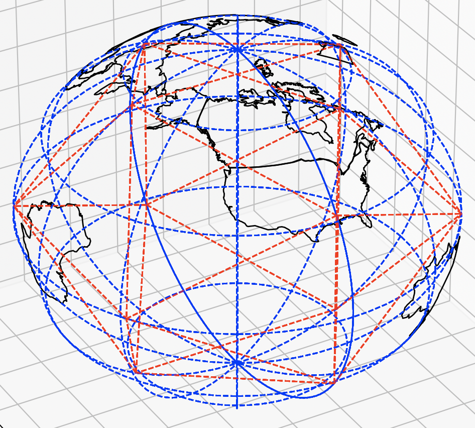

# world map

## data
https://geojson-maps.ash.ms/

- shapefiles - clunky, old fashioned way of storing geo data
- geojson - human readable (so larger), easier to deal with

## examples

- https://medium.com/@lkhphuc/how-to-plot-a-3d-earth-map-using-basemap-and-matplotlib-2bc026483fe4
- https://github.com/lkhphuc/Matplotlib-3D-Basemap
